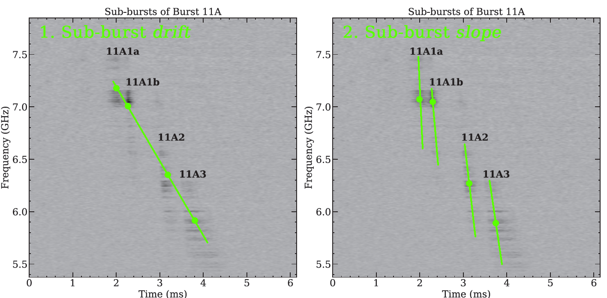

# Sub-burst drift and slope law: A dynamical relationship for the spectro-temporal features of repeating FRBs

This repository primarily contains code for measuring the sub-burst slope of FRBs, which is a quantity closely related to the sub-burst drift rate (see 'Terminology' below). Specifically it contains code for

* computing autocorrelation functions (ACFs) of dynamic spectra of fast radio bursts over a range of dispersion measures (DMs).
* fitting rotatable 2d gaussians to said autocorrelations and obtaining sub-burst slope and duration measurements from sub-bursts.
* producing a fit to the trend between the sub-burst slope and the duration
* supplemental and diagnostic figures. For figures of every burst and the corresponding fit used in the first paper see [`figures/with_drift/`](https://github.com/mef51/sadtrombone/tree/master/figures/with_drift). The second paper already includes every autocorrelation.
* The [`universal`](https://github.com/mef51/sadtrombone/tree/master/universal) folder contains the analysis done for the second paper.

# Terminology

The terminology in the literature concerning these measurements has not settled, so we repeat here what we mean when we say the following terms:

* A 'burst' is an FRB event, on the scale of milliseconds, which can contain a single or multiple pulses/components.
* A 'sub-burst' is a single pulse from an FRB event, even if a single FRB event only contains a single pulse.
* The sub-burst 'drift rate' is the change in frequency between individual resolved sub-bursts in an FRB event that contains multiple components, ie. a train of pulses.
* The 'sad trombone' phenomenon refers to the tendency of sub-bursts in pulse trains to drift downwards in frequency. However, the opposite effect, 'happy trombone', where the sub-bursts drift upward in frequency is also possible.
* The sub-burst 'slope' is the change in frequency within a single sub-burst (ie. a single pulse), and is analogous to the sub-burst drift rate for a single pulse.

Note that due to a late change in word use, almost every reference of "drift" in the codebase is referring primarily to the sub-burst slope. However, unless you are confident that an FRB's structure is resolved in time and that a sub-burst is not actually several sub-bursts smeared together, it can be difficult to know if you have measured the sub-burst slope or the sub-burst drift rate. Regardless, the measurement of interest for these works is primarily the sub-burst slope, and whenever possible different components of FRBs are separated in order to obtain the slope as opposed to the drift rate.

The following figure (adapted from [Gajjar et al. 2018](https://ui.adsabs.harvard.edu/abs/2018ApJ...863....2G/abstract)) illustrates the difference between the two measurements.



If the bursts are unresolved, then the drift rate measurement becomes a slope measurement. All attempts should be made to distinguish these two measurements. However, many unresolved bursts remain. Unresolved pulse trains can appear as sub-bursts that are longer in duration and shallower in slope, which is consistent with the prediction of [Rajabi et al. 2020](https://arxiv.org/abs/2008.02395) for the sub-burst slope. Indeed if the model accurately describes emission from repeating FRBs, then the behaviour of both of these measurements are due to the dynamical motions of the emitting material, and the slopes of sub-bursts as well as the drift rate of sub-bursts in pulse trains can follow the same law (see eqs. 6-8 of [Rajabi et al. 2020](https://arxiv.org/abs/2008.02395)). For more details on this issue see Section 3.1 of [the paper](writeups/drafts/Sub_drift_law_MNRAS_accepted_jul13_2021.pdf).

# Key files

Many of the scripts and notebooks included in the repo are my rough work and experiments.
The following files are what resulted in published figures and are probably the ones you would want to look at:

* [`ProcessBursts.ipynb`](https://github.com/mef51/sadtrombone/blob/master/ProcessBursts.ipynb): Processes bursts from FRB121102
* [`Process180814.py`](https://github.com/mef51/sadtrombone/blob/master/universal/Process180814.py): Processes bursts from FRB180814.J0422+73
* [`CHIME180916_RemixedDM.ipynb`](https://github.com/mef51/sadtrombone/blob/master/universal/CHIME180916_RemixedDM.ipynb): Processes bursts from FRB180916.J0158+65
* [`DMvsDrift.ipynb`](https://github.com/mef51/sadtrombone/blob/master/DMvsDrift.ipynb): Computes the dynamical model's details and produces the key plot of sub-burst slope vs. sub-burst duration.
* [`driftrate.py`](https://github.com/mef51/sadtrombone/blob/master/example/driftrate.py) and [`driftlaw.py`](https://github.com/mef51/sadtrombone/blob/master/example/driftlaw.py) are extracted libraries that can do all the processing in the above notebooks. Their own package will be released shortly. See the example usage below

As stated earlier, most references to 'drift' in the codebase are referring primarily to the sub-burst slope.
Please open an issue for any specific help or questions you might have or email me mchamma at uwo (dot) ca

# Example Usage

[`Example.ipynb`](https://github.com/mef51/sadtrombone/blob/master/example/Example.ipynb) contains a minimal example of processing a burst and computing the dynamical model quantities.

```python
import matplotlib.pyplot as plt
import numpy as np
import pandas as pd
import driftrate, driftlaw

burst = np.load('frb180916_burst18.npy')

# CHIME spectral parameters
params = {
    'dt_s'            : 0.00098304,
    'df_mhz'          : 400/1024,
    'nchan'           : 1024,
    'freq_bottom_mhz' : 400.1953125,
    'freq_top_mhz'    : 800.1953125,
    'dm'              : 348.82
}

targetDM = 348.82
ddm = targetDM - params['dm']
burstid = 'CHIME1'
burst = driftrate.dedisperse(burst, ddm, params['freq_bottom_mhz'], params['df_mhz'], params['dt_s']*1000)
drift, drift_error, popt, perr, theta, red_chisq, center_f = driftrate.processBurst(burst, burstid, params['df_mhz'], params['dt_s']*1000, params['freq_bottom_mhz'], p0=[])
# plt.savefig('{}corr.png'.format(burstid))

# Export to csv using pandas
outputdata = pd.DataFrame(index=[burstid],
                          columns=['amplitude', 'xo', 'yo', 'sigmax', 'sigmay', 'theta', 'amp_error', 'xo_error', 'yo_error', 'sigmax_error', 'sigmay_error', 'angle_error',
                                  'drift (mhz/ms)', 'drift error (mhz/ms)', 'angle', 'center_f', 'red_chisq', 'time_res', 'freq_res'])

outputdata.loc['CHIME1'] = [*popt, *perr, drift, drift_error, theta, center_f, red_chisq, params['dt_s'], params['df_mhz']]
outfile = 'outputexample.csv'
outputdata.to_csv(outfile, index_label="name")
outputdata
```


# Related publications:

 * Fereshteh Rajabi, Mohammed A. Chamma, Christopher M. Wyenberg, Abhilash Mathews, Martin Houde, ["A simple relationship for the spectro-temporal structure of bursts from FRB 121102"](https://academic.oup.com/mnras/article-abstract/498/4/4936/5903289), MNRAS, Volume 498, Issue 4, pp. 4936-4942. On [arxiv](https://arxiv.org/abs/2008.02395)


 * Mohammed A. Chamma, Fereshteh Rajabi, Christopher M. Wyenberg, Abhilash Mathews, Martin Houde, ["Evidence of a shared spectro-temporal law between sources of repeating fast radio bursts"](https://arxiv.org/abs/2010.14041), submitted to MNRAS


